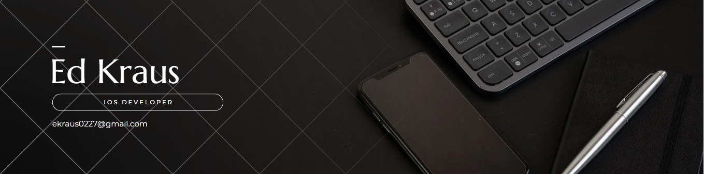

  

### 👋 Hello! I'm a self-taught iOS Developer, looking to build a portfolio to eventually get an iOS Developer career. Here's a bit of what I've been working on.

## AFSpace-A - IN DEVELOPMENT
AFSpace-A is an app for current and prior military personnel. It will provide the bases you can fly in and out from, contact information, and direct link to where you can signup for a flight. Pictures to come 

<!-- Add Images -->
 

**Tech Used**
-  SwiftUI
-  JSON

## [ChatApp](https://github.com/sourkraut1991/SwiftUI-Chat) from [Code With Chris](https://learn.codewithchris.com/courses/chat)

This chat app will introduce you to working with the users Address Book, interesting Firestore database queries, storing and retrieving images using Firestore Storage and more! -- FROM CWC site

<!-- Add Images -->
 

**Tech Used**

- SwiftUI
- Firebase Auth and Database
- Notifications
- Custom Design UI
- Figma
- Address Book

## Fundamentals Course from [Code With Chris](https://pages.github.com/)

##Module 1: War Card Game
<!-- Add Images -->
**Tech Used**
-  SwiftUI

##Module 2: [Recipe List App](https://github.com/sourkraut1991/Recipe-List-App)
<!-- Add Images -->

**Tech Used**
-  SwiftUI
-  JSON

##Module 5: [Learning App](https://github.com/sourkraut1991/https://github.com/sourkraut1991/LearningApp)
<!-- Add Images --> 

**Tech Used**
-  SwiftUI
-  JSON

##Module 6: City Sights App
[City Sights App](https://github.com/sourkraut1991/City-Sights-App)
<!-- Add Images -->

**Tech Used**
-  SwiftUI
-  JSON
-  Yelp API

